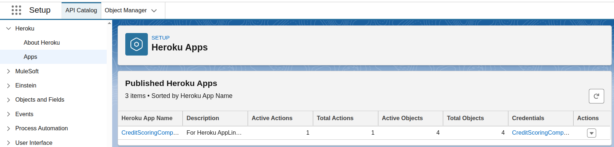
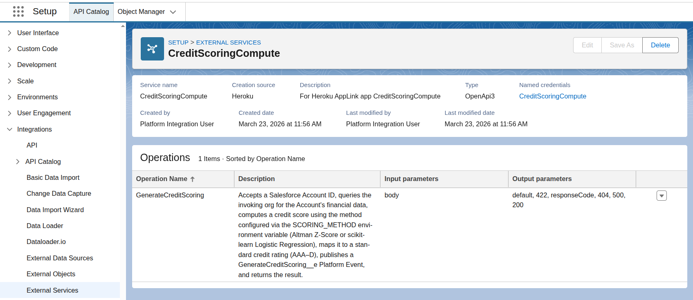
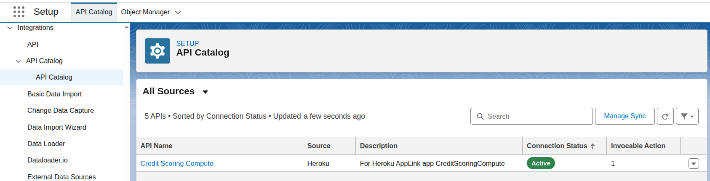
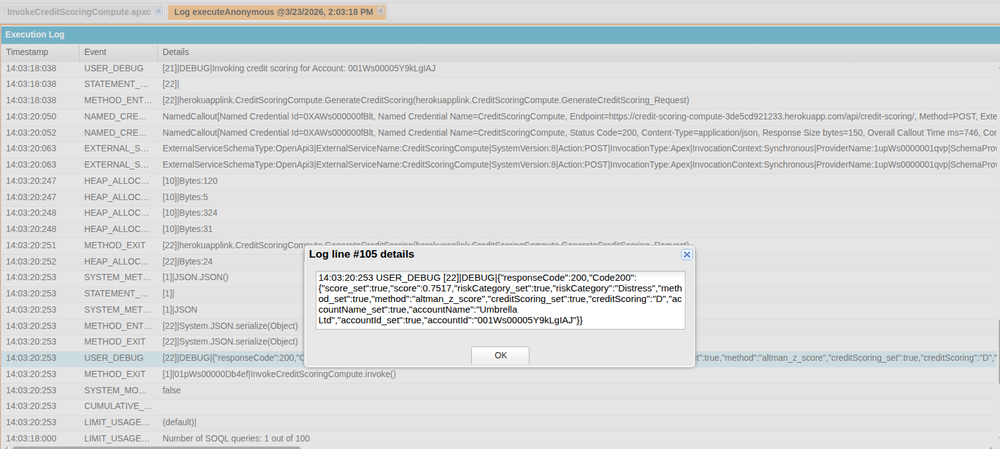

# Credit Scoring API

A [Heroku AppLink](https://www.heroku.com/applink) Python application that computes credit ratings for Salesforce Accounts using the **Altman Z-Score** model. Built with [FastAPI](https://fastapi.tiangolo.com/) and the [Heroku AppLink Python SDK](https://github.com/heroku/heroku-applink-python).

## Table of Contents

- [Project Structure](#project-structure)
- [Overview](#overview)
- [How It Works](#how-it-works)
- [Scoring Method Configuration](#scoring-method-configuration)
- [Salesforce Prerequisites](#salesforce-prerequisites)
- [Sample Account Data](#sample-account-data)
- [Local Development](#local-development)
- [API Endpoints](#api-endpoints)
- [Manual Heroku Deployment](#manual-heroku-deployment)
- [Heroku AppLink Setup](#heroku-applink-setup)
- [Salesforce Setup](#salesforce-setup)
- [Invoking Compute](#invoking-compute)

## Project Structure

This project is organized as a Salesforce DX project with a **ComputeExtension** metadata type. A `ComputeExtension` is a Salesforce metadata descriptor that acts as the container for polyglot language support for Salesforce Compute. It allows you to define and deploy compute workloads written in any supported language (e.g., Python, Java, Node.js) directly within the `force-app/` source tree, alongside your other Salesforce metadata.

The compute extension is located at `force-app/main/default/computeExtensions/CreditScoring/` and contains:

- `CreditScoring.computeExtension` — Salesforce metadata descriptor
- `main.py` — FastAPI application
- `api-spec.yaml` — OpenAPI 3.0 specification
- `Procfile` — Heroku process definition
- `requirements.txt` — Python dependencies
- `tests/` — pytest test suite

## Overview

This application exposes a REST API that:

1. Receives a Salesforce Account ID.
2. Queries the invoking Salesforce org (via Heroku AppLink) for the Account's financial data.
3. Computes a credit score using one of two configurable methods:
   - **Altman Z-Score** (default) — a classic formula-based model using **NumPy**.
   - **Logistic Regression** — a machine-learning approach using **scikit-learn**.
4. Maps the score to a standard credit scoring (AAA–D) and risk category.
5. Publishes a `GenerateCreditScoring__e` Platform Event back to the invoking org.
6. Returns the credit scoring to the caller.

## How It Works

### Altman Z-Score Formula

```
Z = 1.2×X1 + 1.4×X2 + 3.3×X3 + 0.6×X4 + 1.0×X5
```

| Ratio | Definition |
|-------|-----------|
| X1 | Working Capital / Total Assets |
| X2 | Retained Earnings / Total Assets |
| X3 | EBIT / Total Assets |
| X4 | Market Value of Equity / Total Liabilities |
| X5 | Sales / Total Assets |

### Rating Scale

| Z-Score Range | Credit Scoring | Risk Category |
|---------------|---------------|---------------|
| > 3.0 | AAA | Safe |
| 2.7 – 3.0 | AA | Safe |
| 2.4 – 2.7 | A | Safe |
| 2.0 – 2.4 | BBB | Grey Zone |
| 1.8 – 2.0 | BB | Grey Zone |
| 1.5 – 1.8 | B | Distress |
| 1.0 – 1.5 | CCC | Distress |
| < 1.0 | D | Distress |

## Scoring Method Configuration

The scoring algorithm is controlled by the `SCORING_METHOD` environment variable.

| Value | Algorithm | Description |
|-------|-----------|-------------|
| `altman_z_score` | Altman Z-Score | Classic formula-based model (default) |
| `logistic_regression` | Logistic Regression | scikit-learn ML model with pre-configured coefficients |

Set it locally for development:

```bash
export SCORING_METHOD=altman_z_score
```

Or configure it on Heroku:

```bash
heroku config:set SCORING_METHOD=logistic_regression -a your-credit-scoring-app
```

If the variable is unset or contains an unrecognized value, the app defaults to `altman_z_score`.

## Salesforce Prerequisites

### Login to Your Org

Authenticate the Salesforce CLI against your target org and set it as the default:

```bash
sf org login web --set-default --alias my-org
```

### Deploy All Metadata

This project includes the following Salesforce DX metadata under `force-app/`:

- **CreditScoring** — ComputeExtension containing the Python credit scoring application
- **Account custom fields** — 7 Number fields for financial data (`WorkingCapital__c`, `TotalAssets__c`, etc.)
- **GenerateCreditScoring__e** — Platform Event with 4 custom fields (`AccountId__c`, `Rating__c`, `Score__c`, `RiskCategory__c`)
- **CreditScoringCompute** — Session-based Permission Set granting read access to Account/fields and create/read/update on the Platform Event

Deploy everything in one command:

```bash
sf project deploy start --source-dir force-app --api-version 59.0
```

Or deploy individual components:

```bash
sf project deploy start --source-dir force-app/main/default/objects/Account --api-version 59.0
sf project deploy start --source-dir force-app/main/default/objects/GenerateCreditScoring__e --api-version 59.0
sf project deploy start --source-dir force-app/main/default/permissionsets --api-version 59.0
```

> **Note:** The `--api-version 59.0` flag is required to work around a known issue in SF CLI v2.42+ where the default v66.0 SOAP API fails with a "Missing message metadata.transfer:Finalizing" error. This flag can be removed once the CLI bug is resolved.

### Custom Fields on Account

This project includes Salesforce DX metadata for seven custom **Number** fields on the `Account` object, located under `force-app/main/default/objects/Account/fields/`.

| API Name | Label | Type |
|----------|-------|------|
| `WorkingCapital__c` | Working Capital | Number(18, 2) |
| `TotalAssets__c` | Total Assets | Number(18, 2) |
| `RetainedEarnings__c` | Retained Earnings | Number(18, 2) |
| `EBIT__c` | EBIT | Number(18, 2) |
| `MarketValueEquity__c` | Market Value of Equity | Number(18, 2) |
| `TotalLiabilities__c` | Total Liabilities | Number(18, 2) |
| `Sales__c` | Sales | Number(18, 2) |

### Platform Event

The `GenerateCreditScoring__e` Platform Event metadata is included under `force-app/main/default/objects/GenerateCreditScoring__e/` with the following custom fields:

| API Name | Label | Type |
|----------|-------|------|
| `AccountId__c` | Account ID | Text(18) |
| `Rating__c` | Rating | Text(5) |
| `Score__c` | Score | Number(8, 4) |
| `RiskCategory__c` | Risk Category | Text(20) |

### Permission Set

A session-based Permission Set named **CreditScoringCompute** is included under `force-app/main/default/permissionsets/`. It grants:

- **Read** access to the `Account` object and its custom financial fields
- **Create / Read / Update** access to the `GenerateCreditScoring__e` Platform Event

Assign it to a user after deployment:

```bash
sf org assign permset --name CreditScoringCompute --target-org my-org
```

## Sample Account Data

An Anonymous Apex script is provided at `scripts/apex/insertCreditScoringAccounts.apex` to insert five test Accounts with financial data spanning the full rating spectrum:

| Account | Expected Rating | Risk Category |
|---------|----------------|---------------|
| Acme Corporation | AAA | Safe |
| Globex Industries | A | Safe |
| Initech Partners | BBB | Grey Zone |
| Umbrella Ltd | B | Distress |
| Stark Ventures | D | Distress |

> **Note:** The running user must have create access on `Account` and edit access on the custom financial fields. Assign the **CreditScoringCompute** Permission Set (or an equivalent) before running the script.

Run the script via the Salesforce CLI:

```bash
sf apex run --file scripts/apex/insertCreditRatingAccounts.apex
```

Or in VS Code, open the file and run **SFDX: Execute Anonymous Apex with Editor Contents**.

## Local Development

### 1. Clone and Install

```bash
cd force-app/main/default/computeExtensions/CreditScoring
python -m venv venv
source venv/bin/activate
pip install -r requirements.txt
```

### 2. Start the Development Server

```bash
uvicorn main:app --reload
```

The app will be available at `http://localhost:8000`.

### 3. View API Documentation

Visit `http://localhost:8000/docs` for interactive Swagger UI documentation.

> **Note:** Endpoints under the `/api` prefix are protected by the AppLink middleware and require Salesforce context headers. Accessing them directly in the browser will return an error. Use the AppLink service mesh or testing tools to provide the required headers.

## API Endpoints

| Method | Path | Auth | Description |
|--------|------|------|-------------|
| GET | `/` | Public | Welcome page |
| GET | `/health` | Public | Health check |
| POST | `/api/credit-scoring/` | Protected | Compute credit scoring for an Account |
| GET | `/docs` | Public | Swagger UI documentation |

### POST /api/credit-scoring/

**Request Body:**

```json
{
  "data": {
    "accountId": "001XX000003GYQXYA4"
  }
}
```

**Response:**

```json
{
  "accountId": "001XX000003GYQXYA4",
  "accountName": "Acme Corporation",
  "score": 2.85,
  "creditScoring": "AA",
  "riskCategory": "Safe",
  "method": "altman_z_score"
}
```

## Manual Heroku Deployment

### 1. Prerequisites

- [Heroku CLI](https://devcenter.heroku.com/articles/heroku-cli) installed
- A Heroku account

### 2. Create Heroku App

```bash
heroku create your-credit-scoring-app
```

### 3. Add Required Buildpacks

The app lives inside a monorepo, so the [Heroku Monorepo buildpack](https://elements.heroku.com/buildpacks/lstoll/heroku-buildpack-monorepo) must run first to scope the build to the CreditScoring compute extension directory.

```bash
heroku buildpacks:add https://github.com/lstoll/heroku-buildpack-monorepo
heroku buildpacks:add heroku/heroku-applink-service-mesh
heroku buildpacks:add heroku/python
```

### 4. Set APP_BASE

Point the monorepo buildpack at the compute extension root:

```bash
heroku config:set APP_BASE=force-app/main/default/computeExtensions/CreditScoring -a your-credit-scoring-app
```

### 5. Provision the [AppLink Add-on](https://elements.heroku.com/addons/heroku-applink)

```bash
heroku addons:create heroku-applink
```

### 6. Deploy the Application

```bash
git push heroku main
```

### 7. Verify Deployment

```bash
heroku open
```

## Heroku AppLink Setup

### 1. Install AppLink CLI Plugin

```bash
heroku plugins:install @heroku-cli/plugin-applink
```

### 2. Enable Manage Heroku AppLink Permission

Before connecting or publishing, the Salesforce user must have the **Manage Heroku AppLink** user permission. Assign it via a Permission Set:

1. In Salesforce, go to **Setup → Permission Sets**.
2. Create a new Permission Set (or edit an existing one).
3. Navigate to **System Permissions** and enable **Manage Heroku AppLink**.
4. Assign the Permission Set to the user who will run the connect and publish commands.

> **Note:** Without this permission, the `heroku salesforce:connect` and `heroku salesforce:publish` commands will fail with an authorization error.

### 3. Connect to Salesforce Org

```bash
heroku salesforce:connect prod-org -a your-credit-scoring-app
```

This opens a browser OAuth flow to authenticate and link your Salesforce org.

### 4. Publish Your App

Publish the API spec to the connected Salesforce org:

```bash
heroku salesforce:publish force-app/main/default/computeExtensions/CreditScoring/api-spec.yaml \
  -a your-credit-scoring-app \
  -c CreditScoringCompute \
  --connection-name prod-org
```

> **Note:** As of the Salesforce Spring '26 release, new connected apps can no longer be created automatically. Omit the `--authorization-connected-app-name` and `--authorization-permission-set-name` flags. If you have existing connected apps, you can still reference them via the `x-sfdc` section in `api-spec.yaml`.

To verify the publish was successful, go to **Salesforce Setup → Heroku → Apps**. Publishing generates the following resources in your Salesforce org:

- **External Service** named `CreditScoringCompute` — the API client stub generated from the OpenAPI spec
- **Named Credential** named `CreditScoringCompute` — referenced by the External Service to call the Heroku app
- **External Credential** named `CreditScoringCompute` — referenced by the Named Credential for authentication

## Salesforce Setup

After publishing, the following resources are visible in Salesforce Setup.

### Heroku Apps

Navigate to **Setup → Heroku → Apps** to see the published Heroku app and its connected org.



### External Services

Navigate to **Setup → External Services** and select **CreditScoringCompute** to see the generated API operations and their parameters.



### API Catalog

Navigate to **Setup → API Catalog** to see the published API specification.



### Required Salesforce Permissions

Ensure the user has the **CreditScoringCompute** Permission Set assigned, which grants:

- Read access on `Account` (including the custom financial fields)
- Create access on the `GenerateCreditScoring__e` Platform Event

## Invoking Compute

Once the app is deployed, published, and the Permission Set is assigned, you can invoke the Credit Scoring compute extension from Apex.

The [`InvokeCreditScoringCompute`](force-app/main/default/classes/InvokeCreditScoringCompute.cls) class queries for a random Account with all required financial fields populated and invokes the compute extension:

```apex
public class InvokeCreditScoringCompute {
    public static void invoke() {
        List<Account> accounts = [
            SELECT Id FROM Account
            WHERE WorkingCapital__c != null
              AND TotalAssets__c != null
              AND RetainedEarnings__c != null
              AND EBIT__c != null
              AND MarketValueEquity__c != null
              AND TotalLiabilities__c != null
              AND Sales__c != null
        ];
        Integer idx = (Integer) Math.floor(Math.random() * accounts.size());
        Account acct = accounts[idx];

        herokuapplink.CreditScoringCompute creditScoringCompute = new herokuapplink.CreditScoringCompute();
        herokuapplink.CreditScoringCompute.GenerateCreditScoring_Request request = new herokuapplink.CreditScoringCompute.GenerateCreditScoring_Request();
        request.body = new herokuapplink.CreditScoringCompute_CreditScoringData();
        request.body.data = new herokuapplink.CreditScoringCompute_CreditScoringRequest();
        request.body.data.accountId = acct.Id;
        System.debug('Invoking credit scoring for Account: ' + acct.Id);
        try {
            System.debug(JSON.serialize(creditScoringCompute.GenerateCreditScoring(request)));
        } catch (herokuapplink.CreditScoringCompute.GenerateCreditScoring_ResponseException e) {
            System.debug('GenerateCreditScoring failed with response code: ' + e.responseCode);
            if (e.responseCode == 404 && e.Code404 != null) {
                System.debug('404 - Account not found: ' + e.Code404.detail);
            } else if (e.responseCode == 422 && e.Code422 != null) {
                System.debug('422 - Insufficient financial data: ' + e.Code422.detail);
            } else if (e.responseCode == 500 && e.Code500 != null) {
                System.debug('500 - Internal server error: ' + e.Code500.detail);
            } else {
                System.debug('Default response: ' + e.defaultResponse);
            }
        }
    }
}
```

### Using Developer Console

1. Open **Developer Console** from Salesforce Setup.
2. Navigate to **Debug → Open Execute Anonymous Window**.
3. Enter and execute:

```apex
InvokeCreditScoringCompute.invoke();
```

### Using Salesforce CLI

Run the following command to invoke the Apex class via the SF CLI:

```bash
sf apex run --file scripts/apex/invokeCreditScoringCompute.apex
```

Or execute inline:

```bash
echo "InvokeCreditScoringCompute.invoke();" | sf apex run
```

### Invocation Response


